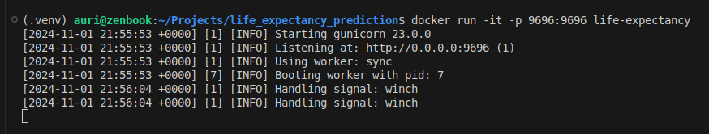

# Life Expectancy Prediction

## Index

* [Project Overview](#project-overview)
    * [Technologies](#technologies)
    * [Workflow](#workflow)
    * [Data](#data)
* [How To Run](#how-to-run)
    * [Initial setup](#initial-setup)
    * [Prediction pipeline](#prediction-pipeline)
    * [Training pipeline](#training-pipeline)
* [Project Details](#project-details)


## Project Overview

Life expectancy is a key indicator of both public and economic health. Thus, understanding the factors that influence life expectancy and being able to predict it allows for the development of targeted strategies aimed at improving the health of a population. From a human health perspective, accurate life expectancy predictions can help governments and organizations plan for the healthcare needs of their populations, ensuring that resources are allocated efficiently. From a socioeconomic standpoint, life expectancy forecasts can help identify emerging markets, allowing businesses to tailor products and services&mdash;such as healthcare products, insurance, and retirement planning&mdash;to meet future demands effectively.

In this project, I analyzed the impact of different health-related, socioeconomic and demographic factors on the life expectancy of human populations. I also developed a regression model to predict the life expectancy of given country based on these key factors.

### Technologies:

* Programming language: **Python (pandas, numpy, plotly)**
* Machine Learning: **scikit-learn**
* Virtual environment: **venv**
* Containerization: **Docker**
* Deployment: **Flask**
* Version control: **Git and GitHub**

### Workflow:

1. Exploratory data analysis
2. Feature selection and data cleaning
3. Data imputation and transformation
4. Model training and hyperparameter tuning
5. Model containerization and deployment

### Data:

I used the **Life Expectancy dataset**, collected by the WHO and the United Nations, assembled and available at: https://www.kaggle.com/datasets/kumarajarshi/life-expectancy-who. This dataset includes yearly health-related, socioeconomic and demographic data, for a period of 16 years (2000-2015), from 183 different countries. Thus, I treated it as a time-series dataset.


## How To Run

This project includes (i) a [**Prediction pipeline**](#prediction-pipeline) to predict the life expectancy of a given country/population and (ii) a [**Training pipeline**](#training-pipeline), in case the model needs to be retrained with new data.

### Initial setup

#### 1. Clone the project repository:

```bash
git clone https://github.com/LaboraTORIbio/life_expectancy_prediction.git
cd life_expectancy_prediction
```

#### 2. Dowload the data:

Download the Life Expectancy dataset as a CSV file and place it in `data/raw/life_expectancy_data.csv`, inside the main project directory.

#### 3. Set up the virtual environment:

To create and activate a virtual environment, run the following commands from the main project directory:

```bash
python3 -m venv life-expectancy
source .venv/bin/activate
```

To deactivate the virtual environment, simply run `deactivate`.

### Prediction pipeline

#### 1. Build and run the Docker container:

The following lines will create a Docker image of the project (installing all required dependencies) and run the Flask API (**api.py**) in a container:

```bash
docker build -t life-expectancy .
docker run -it -p 9696:9696 life-expectancy
```

Once the container is running, the API will be accessible at `http://0.0.0.0:9696`:



#### 2. Make predictions:

Now, you can make predictions running the **test_api.py** script. This script sends a request to the Flask API:

```bash
python ./test_apy.py
```


You can modify the feature values of your country/population inside the script to get life expectancy predictions for different inputs.

### Training pipeline

The training pipeline can be run from the main project directory, in case the model needs to be retrained with new data:

```bash
python app/training.py
```

Alternatively, the input (the Life Expectancy dataset) and output (the exported models) file paths can be specified with the arguments `-i` and `-o`:

```bash
python app/training.py -i data/raw/dataset.csv -o app/new_models.bin
```

Please, note that the pipeline expects as input a dataset with at least 15 features, for which column names must be correctly formatted (check required features and format in the [Project Details](#project-details) or within the training.py script).

The training of a HuberRegressor algorithm is hardcoded in the script. If necessary, the performance of other algorithms can be investigated using the functions available in **experiments.py**.

## Project Details

 The WHO's Life Expectancy dataset includes 22 features, including the life expectancy (target variable), the country name, the year of the record (2000-2015) and 19 are health-related, socioeconomic and demographic factors that could influence life expectancy:

* **Life expectancy:** measured in years
* **Country**
* **Year**
* **Status:** developing or developed country
* **Population:** number of inhabitants of the country
* **Adult mortality:** number of deaths of adults per 1000 population, for both sexes
* **Infant deaths:** number of infant deaths per 1000 population
* **Under-five deaths:** number of under-five deaths per 1000 population
* **GDP:** Gross Domestic Product per capita (in USD)
* **Percentage expenditure:** expenditure on health as a percentage of Gross Domestic Product per capita (%)
* **Total expenditure:** general government expenditure on health as a percentage of total government expenditure (%)
* **Income composition of resources:** Human Development Index in terms of income composition of resources (index ranging from 0 to 1)
* **Hepatitis B:** hepatitis B (HepB) immunization coverage among 1-year-olds (%)
* **Polio:** polio (Pol3) immunization coverage among 1-year-olds (%)
* **Diphteria:** Diphtheria tetanus toxoid and pertussis (DTP3) immunization coverage among 1-year-olds (%)
* **Measles:** number of reported cases of measles per 1000 population
* **HIV/AIDS:** deaths per 1000 live births attributed to HIV/AIDS (0-4 years)
* **Thinness 5-9:** prevalence of thinness among children and adolescents for age 5 to 9 (%)
* **Thinness 10-19:** prevalence of thinness among children and adolescents for age 10 to 19 (%)
* **BMI:** average Body Mass Index of entire population
* **Alcohol:** recorded per capita (15+) consumption (in litres of pure alcohol)
* **Schooling:** number of years of schooling

