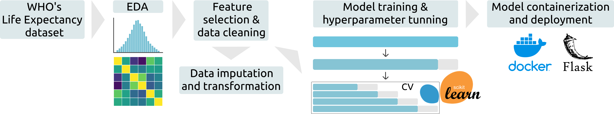

# Life Expectancy Prediction

## Index

* [Project Overview](#project-overview)
    * [Technologies](#technologies)
    * [Workflow](#workflow)
    * [Data](#data)
* [How To Run](#how-to-run)
    * [Initial setup](#initial-setup)
    * [Training pipeline](#training-pipeline)
    * [Inference pipeline](#inference-pipeline)
* [Project Details](#project-details)
    * [EDA and feature importance](#eda-and-feature-importance)
    * [Data imputation and transformation](#data-imputation-and-transformation)
    * [Model training](#model-training)


## Project Overview

Life expectancy is a key indicator of both public and economic health. Thus, understanding the factors that influence life expectancy and being able to predict it allows for the development of targeted strategies aimed at improving the health of a population. From a human health perspective, accurate life expectancy predictions can help governments and organizations plan for the healthcare needs of their populations, ensuring that resources are allocated efficiently. From a socioeconomic standpoint, life expectancy forecasts can help identify emerging markets, allowing businesses to tailor products and services&mdash;such as healthcare products, insurance, and retirement planning&mdash;to meet future demands effectively.

In this project, I analyzed the impact of different health-related, socioeconomic and demographic factors on the life expectancy of human populations. I also developed a regression model to predict the life expectancy of given country based on these key factors.

### Technologies:

* Programming language: **Python (pandas, numpy, plotly)**
* Machine Learning: **scikit-learn**
* Virtual environment: **venv**
* Containerization: **Docker**
* Deployment: **Flask**
* Version control: **Git and GitHub**

### Workflow:




### Data:

I used the **Life Expectancy dataset**, collected by the WHO and the United Nations, assembled and available at: https://www.kaggle.com/datasets/kumarajarshi/life-expectancy-who. This dataset includes yearly health-related, socioeconomic and demographic data, for a period of 16 years (2000-2015), from 183 different countries. Thus, I treated it as a time-series dataset.


## How To Run

This project includes (i) a [**Training pipeline**](#training-pipeline) and (ii) an [**Inference pipeline**](#inference-pipeline) to predict the life expectancy of a given country/population.

### Initial setup

#### 1. Clone the project repository:

```bash
git clone https://github.com/LaboraTORIbio/life_expectancy_prediction.git
cd life_expectancy_prediction
```

#### 2. Dowload the data:

Download the [Life Expectancy dataset](https://www.kaggle.com/datasets/kumarajarshi/life-expectancy-who) as a CSV file and place it in `data/raw/life_expectancy_data.csv`, inside the main project directory.

#### 3. Set up the virtual environment:

To create and activate a virtual environment, run the following commands from the main project directory:

```bash
python3 -m venv life-expectancy
source .venv/bin/activate
```

To deactivate the virtual environment, simply run `deactivate`.

### Training pipeline

The training pipeline can be run from the main project directory:

```bash
python app/training.py
```

Alternatively, the input (the Life Expectancy dataset) and output (the exported models) file paths can be specified with the arguments `-i` and `-o`:

```bash
python app/training.py -i data/raw/dataset.csv -o app/new_models.bin
```

Please, note that the pipeline expects as input a dataset with at least 15 curated features, for which column names must be correctly formatted (check required features and format in the [Project Details](#project-details), the [Project Notebook](https://github.com/LaboraTORIbio/life_expectancy_prediction/blob/main/project_notebook.ipynb) or within the training.py script).

The training of a HuberRegressor algorithm is hardcoded in the script. If necessary, the performance of other algorithms can be investigated using the functions available in **experiments.py** or within the [Project Notebook](https://github.com/LaboraTORIbio/life_expectancy_prediction/blob/main/project_notebook.ipynb).

### Inference pipeline

#### 1. Build and run the Docker container:

The following lines will create a Docker image of the project (installing all required dependencies) and run the Flask API (**api.py**) in a container:

```bash
docker build -t life-expectancy .
docker run -it -p 9696:9696 life-expectancy
```

Once the container is running, the API will be accessible at `http://0.0.0.0:9696`:


#### 2. Make predictions:

Now, you can make predictions running the **test_api.py** script. This script sends a request to the Flask API:

```bash
python ./test_apy.py
```


You can modify the feature values of your country/population inside the script to get life expectancy predictions for different inputs.


## Project Details

A thorough analysis of the dataset is documented in the [Project Notebook](https://github.com/LaboraTORIbio/life_expectancy_prediction/blob/main/project_notebook.ipynb). In this section, I will summarize the relevant findings.
 
### EDA and feature importance

The [WHO's Life Expectancy dataset](https://www.kaggle.com/datasets/kumarajarshi/life-expectancy-who) comprises 22 features, including the life expectancy (target variable), the country name, the year of the record (2000-2015) and 19 are health-related, socioeconomic and demographic factors that could influence life expectancy:

* **Life expectancy:** measured in years
* **Country**
* **Year:** from 2000 to 2015
* **Status:** developing or developed country
* **Population:** number of inhabitants of the country
* **Adult mortality:** number of adult deaths per 1000 population, for both sexes
* **Infant deaths:** number of infant deaths per 1000 population
* **Under-five deaths:** number of under-five deaths per 1000 population
* **GDP:** Gross Domestic Product per capita (in USD)
* **Percentage expenditure:** expenditure on health as a percentage of Gross Domestic Product per capita (%)
* **Total expenditure:** general government expenditure on health as a percentage of total government expenditure (%)
* **Income composition of resources:** Human Development Index in terms of income composition of resources (index ranging from 0 to 1)
* **Hepatitis B:** hepatitis B (HepB) immunization coverage among 1-year-olds (%)
* **Polio:** polio (Pol3) immunization coverage among 1-year-olds (%)
* **Diphteria:** Diphtheria tetanus toxoid and pertussis (DTP3) immunization coverage among 1-year-olds (%)
* **Measles:** number of reported cases of measles per 1000 population
* **HIV/AIDS:** deaths per 1000 live births attributed to HIV/AIDS (0-4 years)
* **Thinness 5-9:** prevalence of thinness among children and adolescents for age 5 to 9 (%)
* **Thinness 10-19:** prevalence of thinness among children and adolescents for age 10 to 19 (%)
* **BMI:** average Body Mass Index of entire population
* **Alcohol:** recorded per capita (15+) consumption (in litres of pure alcohol)
* **Schooling:** number of years of schooling

During exploratory data analysis, I found that several features (`infant_deaths`, `under-five_deaths`, `measles`, `population`, `percentage_expenditure` and `bmi`) included unreliable data (observed as highly unlikely data distributions, see the [Project Notebook](https://github.com/LaboraTORIbio/life_expectancy_prediction/blob/main/project_notebook.ipynb)). Thus, I excluded these columns from further analysis. However, I could incorporate reliable data for `infant_mortality_rate` from another source&mdash;the [UN IGME](https://childmortality.org/) child mortality estimates.

Many features included missing values, though most appeared to be missing at random (MAR) due to high correlation of missingness with other features. However, feature `hepatitis_b` seemed to be missing not at random (MNAR), and thus, I eliminated this feature to avoid biasing the dataset after data imputation.

This analysis highlights the importance of using high-quality data for modeling. In an ideal scenario, actions should have been taken to trace the source of the faulty or missing data, in order to replace it with reliable information. This way, these features could have been incorporated into the modeling process, possibly increasing model accuracy.

Correlation (A) and mutual information (B) analysis reveal, as expected, that adult and infant mortality rates are the best predictors of life expectancy&mdash;the lower the mortality rate, the higher the life expectancy. The next best predictor is the income composition of resources&mdash;a measure of how effectively financial resources are used to support human development&mdash;, followed by the prevalence of thinness in underaged and the number of years of schooling. This suggests that governments should prioritize distributing their resources more efficiently across healthcare (with particular focus on childhood nutrition), education, employment and basic necessities to increase the life expectancy of their populations.

Surprisingly, factors related to disease and immunization, as well as the expenditure on health, did not correlate as strongly with life expectancy. It is possible that basic health measures such as immunization programs and disease control may be already widely implemented and effective. Once a certain level of disease prevention and healthcare is reached, these factors may contribute less to further improvements in life expectancy compared to socioeconomic and lifestyle factors like income distribution, nutrition or education.


### Data imputation and transformation

I performed all analyses taking into account the time-series nature of the Life Expectancy dataset. To avoid data leakeage into future data, I splitted the dataset by years into training (years 2000-2012) and test (years 2013-2015), and fitted the data imputer and transformers using the training set. First, I one-hot encoded the categorical `status` feature. Then, I used the MICE method to impute missing values by modeling each feature with missing values as a function of other features. Finally, I scaled the data using standardization or normalization techniques based on the distribution of the original data (see the [Project Notebook](https://github.com/LaboraTORIbio/life_expectancy_prediction/blob/main/project_notebook.ipynb)).

### Model training

I used a time-aware cross-validation approach (rolling cross-validation) by combining the `TimeSeriesSplit` and `GridSearchCV` classes from scikit-learn. `TimeSeriesSplit` was used for time-based dataset splitting into training and validation sets, while `GridSearchCV` handled cross-validation and hyperparameter tuning for different ML regression models: `SGDRegressor` (a linear regressor that implements stochastic gradient descent and supports incremental learning), `HuberRegressor` (an outlier-robust linear regressor), `DecisionTreeRegressor`, `RandomForestRegressor`, `XGBRegressor` (tree regressor implementing gradient boosting) and `SVR` (support vector regressor).

Although the Random Forest algorithm yielded the best accuracy results, it did so in expense of increasing complexity and training time. Furthermore, when testing the model, it showed signs of overfitting (see the [Project Notebook](https://github.com/LaboraTORIbio/life_expectancy_prediction/blob/main/project_notebook.ipynb)). The HuberRegressor, on the other hand, was simple, fast, did not apparently overfit and was highly accurate, making life expectancy predictions with an average error of &plusmn;2.8 years. Thus, I selected it for model deployment. However, if a higher accuracy is needed, or if frequently updating the model with new data is important, the RandomForest or the SGDRegressor models could be used instead, respectively.


